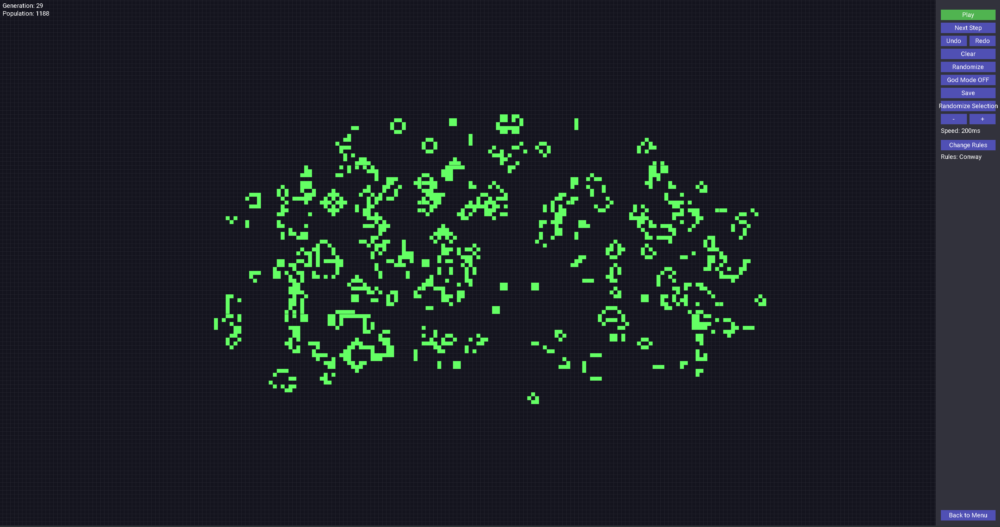

# Shinra Tensei - December 2025

An advanced implementation of Conway's Game of Life, featuring an infinite, navigable grid.



## Author

- [@0xS4cha](https://www.github.com/0xS4cha)
- [@Yondemon4266](https://www.github.com/Yondemon4266)

## Description

**Shinra Tensei** is a simulation of Conway's Game of Life, a cellular automaton devised by the mathematician John Horton Conway. This implementation goes beyond the basics by offering a seemingly infinite world that the user can explore.

The simulation follows two simple rules that lead to complex and emergent patterns.

## Rules of the Game

The universe of the Game of Life is an infinite, two-dimensional orthogonal grid of square *cells*, each of which is in one of two possible states, *alive* or *dead*. Every cell interacts with its eight neighbours, which are the cells that are horizontally, vertically, or diagonally adjacent. At each step in time, the following transitions occur:

1.  Any live cell with fewer than two live neighbours dies, as if by underpopulation.
2.  Any live cell with two or three live neighbours lives on to the next generation.
3.  Any live cell with more than three live neighbours dies, as if by overpopulation.
4.  Any dead cell with exactly three live neighbours becomes a live cell, as if by reproduction.

## Features

- **Infinite Grid**: The simulation map extends infinitely, allowing patterns to grow without being constrained by borders.
- **Navigation**: The view is navigable, allowing the user to pan and explore any part of the grid.

## Controls

- `Arrow Keys`: Navigate and move the camera across the grid to observe different areas of the simulation.

## Compilation

This project uses the SDL2 library for rendering. Ensure you have it installed.

Example (gcc):

```bash
gcc -o shinra_tensei *.c `sdl2-config --cflags --libs` -lSDL2
```

Or use the provided Makefile if present.

## Usage

Simply run the compiled executable to start the simulation.

```bash
./shinra_tensei
```

## Disclaimer

⚠️ **IMPORTANT — Educational use only:**
- Do not copy this code for assessed work in 42 or other courses.
- Use this repository for study and reference only.

## Feedback

If you have any feedback, please open an issue or contact the author.